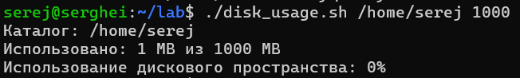
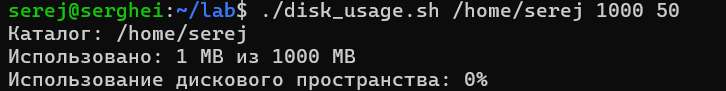
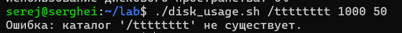
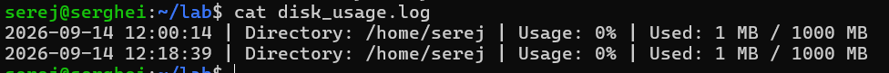

# Lab 01 — Disk Usage Monitoring

**Student:** Maev Serghei

## Описание

В данной лабораторной работе разработан Shell-скрипт
`disk_usage.sh`, предназначенный для мониторинга использования
дискового пространства указанного каталога.

Скрипт позволяет определить текущий размер каталога,
рассчитать процент использования заданного максимального объёма
и записать результат в журнал.

Если использование превышает установленный порог,
скрипт отправляет уведомление на электронную почту.

## Возможности

Скрипт:

- принимает путь к контролируемому каталогу;
- принимает максимальный объём каталога в мегабайтах;
- принимает необязательный порог использования;
- использует 80% в качестве порога по умолчанию;
- проверяет существование каталога;
- проверяет корректность аргументов;
- рассчитывает процент использования;
- записывает результат в `disk_usage.log`;
- отправляет уведомление при превышении порога.

## Синтаксис

```bash
./disk_usage.sh <путь_к_каталогу> <макс_объем_МБ> [порог_%]
```

| Аргумент | Описание | Обязательный |
| --- | :---: | ---: |
| $1 | Путь к каталогу| да |
| $2 | Максимальный объём в МБ | да |
| $3| Порог | нет |

## Примеры использования

### Запуск с параметрами по умолчанию



### Запуск с пользовательским порогом



### Несуществующий каталог



### Проверка журнала




## Вывод

В результате выполнения лабораторной работы создан Shell-скрипт,
который автоматизирует контроль использования дискового пространства
и ведёт журнал результатов проверки.