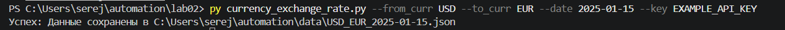
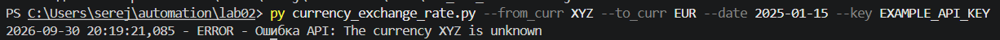

# Lab 02: Взаимодействие с API курсов валют

Данный проект содержит Python-скрипт `currency_exchange_rate.py`, который обращается к локальному веб-сервису (API) для получения курса обмена между двумя валютами на заданную дату.

## Установка зависимостей

Для работы скрипта требуется установленный Python 3 и библиотека `requests`. 
Установите библиотеку с помощью следующей команды в терминале:

```bash
py -m pip install requests
```

*Примечание: перед запуском скрипта убедитесь, что API-сервер (в Docker) предварительно запущен.*

## Структура скрипта и логика работы

Скрипт содержит основную логику для безопасного и удобного взаимодействия с API:

* **`setup_logging(root_dir)`**: Функция, которая настраивает систему логирования. Она перехватывает ошибки и направляет их вывод одновременно в консоль и в файл `error.log`, который создается в корневой папке проекта.
* **`main()`**: Главная функция, выполняющая следующие шаги:
* **Сбор аргументов:** Использование модуля `argparse` для считывания параметров из командной строки.
* **Валидация:** Локальная проверка правильности формата введенной даты (YYYY-MM-DD).
* **Запрос к API:** Формирование URL-параметров (`from`, `to`, `date`) и передача ключа авторизации (`key`) в теле POST-запроса с помощью библиотеки `requests`.
* **Обработка исключений:** Проверка сетевых ошибок (например, выключенный сервер Docker) и программных ошибок, которые возвращает сам API.
* **Сохранение результатов:** Создание папки `data` (если ее нет) в корне проекта и сохранение полученного ответа в JSON файл (с названием, включающим валюты и дату).

## Как использовать (примеры команд)

Скрипт запускается из командной строки. Он принимает следующие обязательные аргументы:

* `--from_curr` — Базовая валюта (например, USD)
* `--to_curr` — Целевая валюта (например, EUR)
* `--date` — Целевая дата в формате YYYY-MM-DD
* `--key` — Ваш API-ключ для доступа к сервису

### Пример успешного запроса:



```json
{
    "from": "USD",
    "to": "EUR",
    "rate": 1.025501172192718,
    "date": "2025-01-15"
}
```
### Пример запроса с ошибкой (несуществующая валюта):



```log
2026-09-30 20:19:21,085 - ERROR - Ошибка API: The currency XYZ is unknown
```
